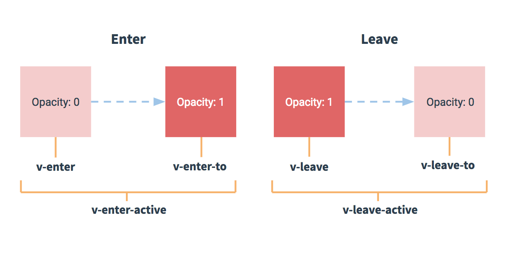

# 06 Animations

<!-- START doctoc generated TOC please keep comment here to allow auto update -->
<!-- DON'T EDIT THIS SECTION, INSTEAD RE-RUN doctoc TO UPDATE -->
**Table of Contents**  *generated with [DocToc](https://github.com/thlorenz/doctoc)*

- [06-01 Introducing Animations](#06-01-introducing-animations)
  - [06-01 Introducing Animations - ex1 - modal](#06-01-introducing-animations---ex1---modal)
  - [06-01 Introducing Animations - transition component](#06-01-introducing-animations---transition-component)
  - [06-01 Introducing Animations - questions about transitions](#06-01-introducing-animations---questions-about-transitions)
  - [06-01 Introducing Animations - modal with transitions - codepen](#06-01-introducing-animations---modal-with-transitions---codepen)
  - [06-01 Introducing Animations - modal with transitions - codepen - CSS Transitions and Vue Transitions](#06-01-introducing-animations---modal-with-transitions---codepen---css-transitions-and-vue-transitions)
  - [06-01 Introducing Animations - modal with transitions 2](#06-01-introducing-animations---modal-with-transitions-2)
    - [06-01 Introducing Animations - modal with transitions 2 - Questions](#06-01-introducing-animations---modal-with-transitions-2---questions)
- [06-02 CSS Animation](#06-02-css-animation)
  - [06-02 CSS Animation ex1 - simplest](#06-02-css-animation-ex1---simplest)
  - [06-02 CSS Animation ex2 - bouncing ball](#06-02-css-animation-ex2---bouncing-ball)
    - [06-02 CSS Animation ex2 - bouncing ball - excerpts](#06-02-css-animation-ex2---bouncing-ball---excerpts)
    - [hacks to get hardware acceleration](#hacks-to-get-hardware-acceleration)
    - [personality and life of animation](#personality-and-life-of-animation)
- [06-03 Challenge 5: Adding Animation](#06-03-challenge-5-adding-animation)
- [06-04 Challenge 5: Solution](#06-04-challenge-5-solution)
- [06-05 Transition Modes](#06-05-transition-modes)
  - [06-05 Transition Modes - ex1 - comic strip replacing](#06-05-transition-modes---ex1---comic-strip-replacing)
- [06-06 JavaScript Hooks](#06-06-javascript-hooks)
  - [06-06 JavaScript Hooks - `v-bind:css="false"`](#06-06-javascript-hooks---v-bindcssfalse)
  - [06-06 JavaScript Hooks - ex1 basic example](#06-06-javascript-hooks---ex1-basic-example)
  - [06-06 JavaScript Hooks - ex2 type here example with dancing words](#06-06-javascript-hooks---ex2-type-here-example-with-dancing-words)
  - [06-06 JavaScript Hooks - passing done to animation libraries](#06-06-javascript-hooks---passing-done-to-animation-libraries)
- [06-07 Connect to Interaction](#06-07-connect-to-interaction)
  - [06-07 Connect to Interaction - Wall-E animation](#06-07-connect-to-interaction---wall-e-animation)
- [06-08 Simple Transition](#06-08-simple-transition)
  - [06-08 Simple Transition - Sliding Page In Nuxt](#06-08-simple-transition---sliding-page-in-nuxt)
- [06-09 Page-Specific Transitions](#06-09-page-specific-transitions)
  - [06-09 Page-Specific Transitions - Basic Example](#06-09-page-specific-transitions---basic-example)
  - [06-09 Page Specific Transitions - JS Hooks](#06-09-page-specific-transitions---js-hooks)
- [06-10 Planning & Fancy Demo](#06-10-planning--fancy-demo)
  - [Fancy Demo - Typeface Site](#fancy-demo---typeface-site)

<!-- END doctoc generated TOC please keep comment here to allow auto update -->

[05 Animations Intro](http://slides.com/sdrasner/intro-to-vue-5?token=5zRhIuNg#/1)  
password: `!vue!`
[Sarah Drasner's Github Repo Here](https://github.com/sdras/intro-to-vue)  

## 06-01 Introducing Animations
[06-01 Introducing Animations starting video](https://frontendmasters.com/courses/vue/introducing-animations/)
[06-01 Introducing Animations starting slides](http://slides.com/sdrasner/intro-to-vue-5?token=5zRhIuNg#/1)

Transitions: taking a thing and interpolating between two of its states (example: changing opacity)
Animations: have multiple states

### 06-01 Introducing Animations - ex1 - modal
[06-01 Introducing Animations - ex1 - modal slides](http://slides.com/sdrasner/intro-to-vue-5?token=5zRhIuNg#/6)  

We have a modal and it's going to show a child and then show a child button
Humans aren't accustomed to this - things happen in transitions
The vue component `<transition name="fade">` is built-in: 

```vue
<transition name="fade">
  <app-child v-if="isShowing" class="modal">
    <button @click="toggleShow">
      Close
    </button>
  </app-child>
</transition>
```

Not everything needs a `<transition>` component

### 06-01 Introducing Animations - transition component
http://slides.com/sdrasner/intro-to-vue-5?token=5zRhIuNg#/9
`v-enter-active` - `v-enter` to `v-enter-to`
`v-leave-active` - `v-leave` to `v-leave-to`

This is using classes that vue puts in there, example: 
```vue
.v-enter-active {
  transition: color 1s;
}
```

Another example - 

```vue
.fade-enter-active, .fade-leave-active {
  transition: opacity 0.25s ease-out;
}

.fade-enter, .fade-leave-to {
  opacity: 0;
}
```

* `ease-in` is good for exits
* `ease-out` is good for entrances

this is the default (so it's unnecessary):

```vue
.fade-enter-to, .fade-leave {
  opacity: 1;
}
```

### 06-01 Introducing Animations - questions about transitions
What is this about? are these really classes we'll put in `<styles>`?
Answer: Yes (see below)

### 06-01 Introducing Animations - modal with transitions - codepen
http://slides.com/sdrasner/intro-to-vue-5?token=5zRhIuNg#/11

```vue
<template>
  <div id="app">
      <h3>Let's trigger this here modal!</h3>
      <button @click="toggleShow">
        <span v-if="isShowing">Hide child</span>
        <span v-else>Show child</span>
      </button>
    <transition name="fade">
      <app-child v-if="isShowing" class="modal">
        <button @click="toggleShow">
          Close
        </button>
      </app-child>
    </transition>
  </div>
  
  <script type="text/x-template" id="childarea">
    <div>
      <h2>Here I am!</h2>
          <slot></slot>
    </div>
  </script>
</template>

<style>
  body {
    font-family: 'Roboto Mono', serif;
    display: flex;
    justify-content: center;
  }
  
  #app {
    text-align: center;
    margin: 60px;
    max-width: 370px;
    display: flex;
    justify-content: center;
    align-items: center;
    flex-direction: column;
  }
  
  button {
    font-family: 'Roboto Mono';
    border: 2px solid black;
    background: white;
    padding: 10px 15px;
    margin: 0 10px;
    outline: 0;
    width: 60%;
    cursor: pointer;
  }
  
  h4 {
    margin: 0 0 15px;
  }
  
  .modal {
    background: cyan;
    color: black;
    padding: 20px;
    width: 200px;
    position: absolute;
  }
  
  .fade-enter-active, .fade-leave-active {
    transition: opacity 0.25s ease-out;
  }
  
  .fade-enter, .fade-leave-to {
    opacity: 0;
  }
</style>

<script>
  const Child = {
    template: '#childarea'
  };
  
  new Vue({
    el: '#app',
    data() {
      return {
        isShowing: false
      }
    },
    methods: {
      toggleShow() {
        this.isShowing = !this.isShowing;
      }
    },
    components: {
      appChild: Child
    }
  });
</script>
```

### 06-01 Introducing Animations - modal with transitions - codepen - CSS Transitions and Vue Transitions
* The most important part of this is the `<transition>` component and the CSS bindings
* Note that `<transition name="fade">` translates into `.fade-enter-active, .fade-leave-active`, etc
* Normally, you use a `v-if` inside of a `<transition>` component
* Vue adds the class names automatically at the correct time
* This uses CSS's [`transition`](https://www.w3schools.com/css/css3_transitions.asp) to do the real work

Here are the relevant excerpts from the full code sample above:

```vue
<template>
  <transition name="fade">
    <app-child v-if="isShowing" class="modal">
      <button @click="toggleShow">
        Close
      </button>
    </app-child>
  </transition>
</template>

<style>
  .fade-enter-active, .fade-leave-active {
    transition: opacity 0.25s ease-out;
  }
  
  .fade-enter, .fade-leave-to {
    opacity: 0;
  }
</style>
```

### 06-01 Introducing Animations - modal with transitions 2
[06-01 Introducing Animations - modal with transitions 2 video - 1000](https://frontendmasters.com/courses/vue/introducing-animations/)  
[06-01 Introducing Animations - modal with transitions 2 codepen example](http://slides.com/sdrasner/intro-to-vue-5?token=5zRhIuNg#/16)  

We can't use the `<transition>` component for some things, for example: 
_if we wanted to make that background content fade out of view, 
so that the modal took center stage and the background lost focus_

But we can use a class: 

```vue
<template>
  <div v-bind:class="[isShowing ? blurClass : '', bkClass]">
    <h3>Let's trigger this here modal!</h3>
    <button @click="toggleShow">
      <span v-if="isShowing">Hide child</span>
      <span v-else>Show child</span>
    </button>
  </div>
</template>

<style>
  .bk {
    transition: all 0.1s ease-out;
  }
  
  .blur {
    filter: blur(2px);
    opacity: 0.4;
  }
</style>

<script>
  new Vue({
    el: '#app',
    data() {
      return {
        isShowing: false,
        bkClass: 'bk', // here's where the class is set
        blurClass: 'blur'
      }
    },
    ...
  });
</script>
```

#### 06-01 Introducing Animations - modal with transitions 2 - Questions
Why didn't she use literal classes? Not sure.


## 06-02 CSS Animation 
[CSS Animation starting video](https://frontendmasters.com/courses/vue/css-animation/)  
[CSS Animation starting slide](http://slides.com/sdrasner/intro-to-vue-5?token=5zRhIuNg#/17)  

**Transition & CSS Animations are two different things, but we'll use `<transition>` component for both**
### 06-02 CSS Animation ex1 - simplest
I don't understand this simple example, 
perhaps because I don't understand CSS  Animations very well

```vue
enter-active-class="toasty"
leave-active-class="bounceOut"

.toasty {
  toasty 1s ease both;
}
```

### 06-02 CSS Animation ex2 - bouncing ball
[bouncing ball codepen](http://slides.com/sdrasner/intro-to-vue-5?token=5zRhIuNg#/21) 


```vue
<template>
  <div id="app">
    <h3>Bounce the Ball!</h3>
    <button @click="toggleShow">
      <span v-if="isShowing">Get it gone!</span>
      <span v-else>Here we go!</span>
    </button>
    <transition
      name="ballmove"
      enter-active-class="bouncein"
      leave-active-class="rollout">
    <div v-if="isShowing">
      <app-child class="child"></app-child>
    </div>
    </transition>
  </div>
  
  <script type="text/x-template" id="childarea">
    <div class="ball"></div>
  </script>
</template>

<style lang="scss">
  @mixin ballb($yaxis: 0) {
    transform: translate3d(0, $yaxis, 0);
  }
  
  body {
    font-family: 'Bitter', serif;
    width: 100vw;
    height: 100vh;
    background: #eeeeee; /* Old browsers */
    background: -moz-linear-gradient(top, #eeeeee 0%, #cccccc 65%, #eeeeee 99%); /* FF3.6-15 */
    background: -webkit-linear-gradient(top, #eeeeee 0%,#cccccc 65%,#eeeeee 99%); /* Chrome10-25,Safari5.1-6 */
    background: linear-gradient(to bottom, #eeeeee 0%,#cccccc 65%,#eeeeee 99%); /* W3C, IE10+, FF16+, Chrome26+, Opera12+, Safari7+ */
    filter: progid:DXImageTransform.Microsoft.gradient( startColorstr='#eeeeee', endColorstr='#eeeeee',GradientType=0 ); /* IE6-9 */
  }
  
  #app {
    text-align: center;
    margin: 60px;
    max-width: 320px;
    margin: 0 auto;
    display: table;
  }
  
  .num {
    color: #AF007E;
  }
  
  button {
    font-family: 'Bitter';
    background: #c62735;
    color: white;
    border: 0;
    padding: 5px 15px;
    margin: 0 10px;
    border-radius: 4px;
    outline: 0;
    cursor: pointer;
  }
  
  h4 {
    margin: 0 0 15px;
  }
  
  hr {
    border-color: #F2FAFF;
    opacity: 0.5;
    margin: 15px 0;
  }
  
  .ball {
    width: 60px;
    height: 60px;
    background: url("https://s3-us-west-2.amazonaws.com/s.cdpn.io/28963/soccerball.svg");
    transform-origin: 50% 50%;
    transform: translate3d(0, 300px, 0) rotate(0);
  }
  
  @keyframes bouncein { 
    1% { @include ballb(-400px); }
    20%, 40%, 60%, 80%, 95%, 99%, 100% { @include ballb() }
    30% { @include ballb(-80px); }
    50% { @include ballb(-40px); }
    70% { @include ballb(-30px); }
    90% { @include ballb(-15px); }
    97% { @include ballb(-10px); }
  }
  
  @keyframes rollout { 
    0% { transform: translate3d(0, 300px, 0); }
    100% { transform: translate3d(1000px, 300px, 0); }
  }
  
  @keyframes ballroll {
    0% { transform: rotate(0); }
    100% { transform: rotate(1000deg); }
  }
  
  .ballmove-enter {
    @include ballb(-400px);
  }
  
  .bouncein { 
    animation: bouncein 0.9s cubic-bezier(0.47, 0, 0.745, 0.715) both;
  }
  
  .rollout { 
    width: 60px;
    height: 60px;
    animation: rollout 2s cubic-bezier(0.55, 0.085, 0.68, 0.53) both; 
    div {
      animation: ballroll 2s cubic-bezier(0.55, 0.085, 0.68, 0.53) both; 
    }
  }
</style>

<script>
  const Child = {
    template: '#childarea'
  };
  
  new Vue({
    el: '#app',
    data() {
      return {
        isShowing: false 
      }
    },
    methods: {
      toggleShow() {
        this.isShowing = !this.isShowing;
      }
    },
    components: {
      appChild: Child
    }
  });
</script>
```

#### 06-02 CSS Animation ex2 - bouncing ball - excerpts

```vue
<template>
<!--  ...-->
    <transition
      name="ballmove"
      enter-active-class="bouncein"
      leave-active-class="rollout">
    <div v-if="isShowing">
      <app-child class="child"></app-child>
    </div>
    </transition>
<!--  ...-->
</template>

<style lang="scss">
  @mixin ballb($yaxis: 0) {
    // this tells browser we want hardware acceleration
    transform: translate3d(0, $yaxis, 0);
  }
  
  /**
   * note - properties that are left out are interpolated: 
   * https://developer.mozilla.org/en-US/docs/Web/CSS/@keyframes#When_properties_are_left_out_of_some_keyframes
   */
  @keyframes bouncein { 
    1% { @include ballb(-400px); }
    20%, 40%, 60%, 80%, 95%, 99%, 100% { @include ballb() }
    30% { @include ballb(-80px); }
    50% { @include ballb(-40px); }
    70% { @include ballb(-30px); }
    90% { @include ballb(-15px); }
    97% { @include ballb(-10px); }
  }
  
  .ballmove-enter {
    @include ballb(-400px);
  }
  
  .bouncein { 
    animation: bouncein 0.9s cubic-bezier(0.47, 0, 0.745, 0.715) both;
  }
  
  .rollout { 
    width: 60px;
    height: 60px;
    animation: rollout 2s cubic-bezier(0.55, 0.085, 0.68, 0.53) both; 
    div {
      animation: ballroll 2s cubic-bezier(0.55, 0.085, 0.68, 0.53) both; 
    }
  }
</style>
```

The `enter-active-class` is set to `bouncein`, which is an 
[`@keyframes` at rule](https://developer.mozilla.org/en-US/docs/Web/CSS/@keyframes).

#### hacks to get hardware acceleration
We have a couple hacks to get hardware acceleration
`transform: translate3d(0, $yaxis, 0);` is one, the "null z" hack

If you use margin, `top`, etc, are not as performant as transforms
There are `skew`, `rotate`, `translateX`, `translateY`, etc

#### personality and life of animation
The [`timing-function` parameter is the life of a CSS `animation`](https://developer.mozilla.org/en-US/docs/Web/CSS/animation).

```
.bouncein { 
  animation: bouncein 0.9s cubic-bezier(0.47, 0, 0.745, 0.715) both;
}
```

See [cubic-bezier.com](https://cubic-bezier.com/#.17,.67,.83,.67) for examples


## 06-03 Challenge 5: Adding Animation
[Challenge 5 Video](https://frontendmasters.com/courses/vue/challenge-5-adding-animation/)  
[Challenge 5 Codepen Start](https://codepen.io/sdras/pen/pweqaN)  
[Challenge 5 Codepen - My Fork](https://codepen.io/codekiln/pen/OYqdwd)  

Take these classes, or name them something else, and plug css animations into those two classes
one for enter, one for exit

Here's the relevant spot in the markup: 

```vue
<transition
    name="ballmove"
    enter-active-class="bouncein"
    leave-active-class="rollout">
<!--...-->
</transition>
```

From this we know that when the ballmove transition enters the active transition state, 
it will attach the `bouncein` class.

Key parts I added: 

```vue
@keyframes bouncein { 
  1% { @include ballb(-400px); }
  20%, 40%, 60%, 80%, 95%, 99%, 100% { @include ballb() }
  30% { @include ballb(-80px); }
  50% { @include ballb(-40px); }
  70% { @include ballb(-30px); }
  90% { @include ballb(-15px); }
  97% { @include ballb(-10px); }
}

@keyframes rollout {
  0% { transform: translate3d( 0, 300px, 0); }
  100% { transform: translate3d( 1000px, 300px, 0); }
}

@keyframes ballroll {
  0% { transform: rotate(0); }
  100% { transform: rotate(1000deg); }
}

.ballmove-enter {
  @include ballb(-400px);
}

.bouncein {
  animation: bouncein 0.9s cubic-bezier(0.47, 0, 0.745, 0.715) both;
}

.rollout { 
  width: 60px;
  height: 60px;
  animation: rollout 2s cubic-bezier(0.55, 0.085, 0.68, 0.53) both; 
  div {
    animation: ballroll 2s cubic-bezier(0.55, 0.085, 0.68, 0.53) both; 
  }
}
```

Key points: 
* make three animations with the CSS [`keyframes` at-rule](https://developer.mozilla.org/en-US/docs/Web/CSS/@keyframes)
* make a `<transition name="ballmove" enter-active-class="bouncein" leave-active-class="rollout">` and  make `bouncein` and `rollout` classes
* in those classes, use the CSS [`animation` shorthand property to reference the keyframes created](https://developer.mozilla.org/en-US/docs/Web/CSS/animation)
* using the name of the transition use the [Transition Classes mentioned in in the vue docs](https://vuejs.org/v2/guide/transitions.html#Transition-Classes), 
  for example, if the name of the transition is `ballmove`, you can do `.ballmove-enter`

## 06-04 Challenge 5: Solution
[challenge 5 solution video](https://frontendmasters.com/courses/vue/challenge-5-solution/)  
Usually, when things are entering and exiting, you want 


## 06-05 Transition Modes  
[06-05 Transition Modes video](https://frontendmasters.com/courses/vue/transition-modes/)  

* There are a lot of things in vue that just make things easier, 
  for example `.prevent` to prevent the bubbling
* transition modes are one of those
* common case - when something is entering, and another is coming in
* transition modes let us specify an order for operations
  * `out-in` - (almost always this one) current element goes out new one goes in.
  * `in-out` - (rare) current element waits until the new element is done transitioning in to fire

### 06-05 Transition Modes - ex1 - comic strip replacing
[ex1 - two elements - codepen](http://slides.com/sdrasner/intro-to-vue-5?token=5zRhIuNg#/29)

```vue
<template>
  <transition name="flip" mode="out-in">
    <slot v-if="!isShowing"></slot>
    
  </transition>
</template>

<style>
  .flip-enter-active {
    transition: all .2s cubic-bezier(0.55, 0.085, 0.68, 0.53); //ease-in-quad
  }
  
  .flip-leave-active {
    transition: all .25s cubic-bezier(0.25, 0.46, 0.45, 0.94); //ease-out-quad
  }
  
  .flip-enter, .flip-leave-to {
    transform: scaleY(0) translateZ(0);
    opacity: 0;
  }
</style>
```

Note that the `flip` part of the class here comes from the `<transition name="flip" mode="out-in">`


## 06-06 JavaScript Hooks
[06-06 JavaScript Hooks video](https://frontendmasters.com/courses/vue/javascript-hooks/)  
[06-06 JavaScript Hooks first slide](http://slides.com/sdrasner/intro-to-vue-5?token=5zRhIuNg#/32)  

* Use JS Hooks when you want to do animation but _not_ use CSS
* uses your own names: 

```vue
<transition 
  @before-enter="beforeEnter"
  @enter="enter"
  @after-enter="afterEnter"
  @enter-cancelled="enterCancelled"

  @before-leave="beforeLeave"
  @leave="leave"
  @after-leave="afterLeave"
  @leave-cancelled="leaveCancelled"
  :css="false">
 </transition>
```

### 06-06 JavaScript Hooks - `v-bind:css="false"`
* `:css="false"` means `v-bind:css="false"` and it tells Vue to 
  "ignore CSS" (what does Sarah mean by this?)
  * she says it's meant to avoid race conditions or collisions
  * the [`:css="false"`](https://vuejs.org/v2/guide/transitions.html#JavaScript-Hooks) advice
    comes from the vue docs: _It’s also a good idea to explicitly add v-bind:css="false" for 
    JavaScript-only transitions so that Vue can skip the CSS detection. This also prevents 
    CSS rules from accidentally interfering with the transition._
    * See my SO: [`(VueJS) What exactly does v-bind:css=“false” do, and where is it documented?`](https://stackoverflow.com/questions/56451332/vuejs-what-exactly-does-v-bindcss-false-do-and-where-is-it-documented)
    * `#PetPeeves` - it just really stinks that Vue invents all these arbitrary HTML-ish constructs
      and then not only doesn't document them properly, but also makes them so darn hard to google
      because _they are not javascript_ 
  * This appears to be a magical, relatively undocumented thing in vue - what does it mean to 
    skip the CSS detection?
* reminder `@` means `v-on`

```vue
<transition 
  @before-enter="beforeEnter"
  @enter="enter"
  @after-enter="afterEnter"
  @enter-cancelled="enterCancelled"

  @before-leave="beforeLeave"
  @leave="leave"
  @after-leave="afterLeave"
  @leave-cancelled="leaveCancelled"
  :css="false">
 
 </transition>
```

Sara says that this naming convention is to avoid name collisions with js
* what's an example? 

### 06-06 JavaScript Hooks - ex1 basic example
```vue
<transition 
  @enter="enterEl"
  @leave="leaveEl"
  :css="false">
 <!-- put element here-->
 </transition>
 
 methods: {
   enterEl(el, done) {
     //entrance animation
     done();
  },
  leaveEl(el, done) {
    //exit animation
    done();
  },
}
```

Note that the methods are passed the element and a done callback.
* the `el` is the reference for an animation library

### 06-06 JavaScript Hooks - ex2 type here example with dancing words
[codepen - ex2 type here example with dancing words](http://slides.com/sdrasner/intro-to-vue-5?token=5zRhIuNg#/36)  

She uses library called Greensock to say "from " and "to"

```vue
new Vue({
  el: '#app',
  data() {
    return {
      message: 'This is a good place to type things.',
      load: false
    }
  },
  methods: {
    beforeEnter(el) {
      TweenMax.set(el, {
        transformPerspective: 600,
        perspective: 300,
        transformStyle: "preserve-3d",
        autoAlpha: 1
      });
    },
    enter(el, done) {
      ...
      tl.add("drop");
      for (var i = 0; i < wordCount; i++) {
        tl.from(split.words[i], 1.5, {
          z: Math.floor(Math.random() * (1 + 150 - -150) + -150),
          ease: Bounce.easeOut
        }, "drop+=0." + (i/ 0.5));
       ...
    }
  }
});
```

### 06-06 JavaScript Hooks - passing done to animation libraries
Several libraries require you send a callback 

```vue
let split = new SplitText(el, { type: "words" }),
    wordCount = split.words.length,
    tl = new TimelineMax({ onComplete: done });
```

## 06-07 Connect to Interaction
[Connect to Interaction Video](https://frontendmasters.com/courses/vue/connect-to-interaction/)  
[Connect to Interaction Slide](http://slides.com/sdrasner/intro-to-vue-5?token=5zRhIuNg#/40) 

### 06-07 Connect to Interaction - Wall-E animation
[Wall-E Codepen](https://codepen.io/sdras/pen/YZBGNp)
* had to click through to the codepen to see how mouse moves affected it

```vue
<div id="app" @mousemove="coordinates">
  <p>Move your mouse or tap</p>
  <svg id="walle" xmlns="http://www.w3.org/2000/svg" viewBox="0 0 139.4 129.4">
  <defs>
    <clipPath id="clip-path" transform="translate(-81.8 -924.4)">
      <circle cx="140.5" cy="978.2" r="4.3" fill="none"/>
    </clipPath>
  </defs>
  ...
  <g id="Layer_2" data-name="Layer 2">
    <g class="head" v-bind:class="{isFlipped: flip}">
  ...
</div>
```

The key parts here: 
* `<g class="head" v-bind:class="{isFlipped: flip}">`
  * flips the head when the mouse moves to the other side
* `<div id="app" @mousemove="coordinates">`
  * `@mousemove="coordinates"` here is equivalent to `v-on:mousemove=coordinates`
  * `coordinates` is a function that receives the `mousemove` event `e`:

```vue
coordinates(e) {
  const audio = new Audio('https://s3-us-west-2.amazonaws.com/s.cdpn.io/28963/Whoa.mp3'),
    walleBox = document.getElementById('walle').getBoundingClientRect(),
    ...

  this.y = e.clientY / 80 - 2;
  if (e.clientX > walleCoords) {
  ...

    this.startArms.progress(1 - (e.clientX / walleCoords)).pause();

  }
},
```

Using the `mounted` hook lets you start a loop that always runs.


## 06-08 Simple Transition
[Simple Transition Video](https://frontendmasters.com/courses/vue/simple-transition/)
[Simple Transition Slides](http://slides.com/sdrasner/intro-to-vue-5?token=5zRhIuNg#/46)

### 06-08 Simple Transition - Sliding Page In Nuxt
* She's going to make a page transition and to do that she will disable Nuxt's default progress bar
  * in `nuxt.config.js` she set `loading: false` to disable it and added new CSS assets
  * the [next page will slide in from one side of the screen](http://slides.com/sdrasner/intro-to-vue-5?token=5zRhIuNg#/50)
* the transition component and how you _don't_ have to use it (?)
  * I think she's saying that Nuxt has the transition component built into its idea of pages
* the `page` hook (?), which seems like it's related to the 
  [`v-enter`, `v-leave` hooks according to this slide](http://slides.com/sdrasner/intro-to-vue-5?token=5zRhIuNg#/48)
  * In her [new CSS file, she's using `.page-enter-active`, `.page-leave-active`](http://slides.com/sdrasner/intro-to-vue-5?token=5zRhIuNg#/49); 
  * I assume `page` hook comes from nuxt
  * 
  * here's the CSS
    ```css
      .page-enter-active, .page-leave-active {
        transition: all .25s ease-out;
      }
  
      .page-enter, .page-leave-active {
        opacity: 0;
        transform: scale(0.95);
        transform-origin: 50% 50%;
      }

      .page-enter-active {
        animation: acrossIn .45s ease-out both;
      } 
       
      .page-leave-active {
        animation: acrossOut .65s ease-in both;
      } 
       
      @keyframes acrossIn {
        0% {
          transform: translate3d(-100%, 0, 0);
        }
       
        100% {
          transform: translate3d(0, 0, 0);
        }
      }
       
      @keyframes acrossOut {
        0% {
          transform: translate3d(0, 0, 0);
        }
       
        100% {
          transform: translate3d(100%, 0, 0);
        }
      }
    ```
  * section: 
    ```css
    .page-enter, .page-leave-active {
      opacity: 0;
      transform: scale(0.95);
      transform-origin: 50% 50%;
    }
    ```
    * when the page begins entering, it is invisible
    * when the page leaves, it is invisible
    * `transform: scale(0.95)` - does it shrink?
    * [`transform-origin`](https://developer.mozilla.org/en-US/docs/Web/CSS/transform-origin)
    * it seems like this should make the screen move down and to the right???
    * I don't get this animation ...


## 06-09 Page-Specific Transitions
[Page-Specific Transitions Video](https://frontendmasters.com/courses/vue/page-specific-transitions/)
[Page-Specific Transitions Slides](http://slides.com/sdrasner/intro-to-vue-5?token=5zRhIuNg#/52)

* add page-specific transitions in Nuxt by exporting an object with 
  key `transitions` set to the animation you want
* library [Animate.css](https://daneden.github.io/animate.css/) is helpful here

### 06-09 Page-Specific Transitions - Basic Example
[Basic Example - Demo](http://slides.com/sdrasner/intro-to-vue-5?token=5zRhIuNg#/55)

```vue
<template>
  <div class="container">
    <h1>This is the contact page</h1>
    <p><nuxt-link to="/">Home page</nuxt-link></p>
  </div>
</template>
 
<script>
export default {
  transition: 'fadeOpacity'
}
</script>
```

After you have this transition set up, hook into it in `main.css` or component scoped styles
```css
.fadeOpacity-enter-active, .fadeOpacity-leave-active {
  transition: opacity .35s ease-out;
}
 
.fadeOpacity-enter, .fadeOpacity-leave-active {
  opacity: 0;
}
```

### 06-09 Page Specific Transitions - JS Hooks
[page specific js hooks slides](http://slides.com/sdrasner/intro-to-vue-5?token=5zRhIuNg#/56)

js hooks is "where the good stuff is at in my mind"

[demo of using js hooks - spinning page](http://slides.com/sdrasner/intro-to-vue-5?token=5zRhIuNg#/62)

basic example has `beforeEnter`, `enter`, `leave` hooks
* inside of those, used [`TweenMax` from `gsap`](https://greensock.com/tweenmax/)

she has [a slide about animating single elements](http://slides.com/sdrasner/intro-to-vue-5?token=5zRhIuNg#/63)

around 2:50 she mentions that Vue has `$refs` and its purpose is similar to react
* she never has this in her code as far as I can see
* she mentions that some libraries allow you to access dom node directly
* see [Vue Docs - Accessing Child Component Instances & Child Elements](https://vuejs.org/v2/guide/components-edge-cases.html#Accessing-Child-Component-Instances-amp-Child-Elements)


## 06-10 Planning & Fancy Demo
[Planning & Fancy Demo Video](https://frontendmasters.com/courses/vue/planning-fancy-demo/)
[Planning & Fancy Demo Slides](http://slides.com/sdrasner/intro-to-vue-5?token=5zRhIuNg#/64)

Things that need to stay constant can live outside of pages.
For example, here, `Navigation` is outside of the pages.

```vue
<!-- layouts/default.vue -->
<template>
  <div>
    <Navigation />
    <nuxt/>
  </div>
</template>

<script>
import Navigation from '~components/Navigation.vue'

export default {
  components: {
    Navigation
  }
}
</script>
```

### Fancy Demo - Typeface Site
[typeface site demo video link](http://slides.com/sdrasner/intro-to-vue-5?token=5zRhIuNg#/68)
Here is the actual live URL: https://nuxt-type.now.sh

Demonstrates page transitions
The mountains have different transitions than the fonts
* it looked dumb when they all had the same transition

Exercise - we don't do
