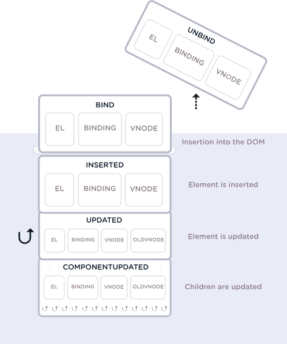

# 07 Filters, Mixins, & Custom Directives
[07 Filters, Mixins, & Custom Directives - Video](https://frontendmasters.com/courses/vue/filters/)
[07 Filters, Mixins, & Custom Directives - Slides](http://slides.com/sdrasner/intro-to-vue-6?token=fcL8qgTg#/)
* password: `!vue!`
[Sara's Intro to Vue Repo on Github](https://github.com/sdras/intro-to-vue)


## Table of Contents
<!-- START doctoc generated TOC please keep comment here to allow auto update -->
<!-- DON'T EDIT THIS SECTION, INSTEAD RE-RUN doctoc TO UPDATE -->
**Table of Contents**  *generated with [DocToc](https://github.com/thlorenz/doctoc)*

  - [07-01 Filters](#07-01-filters)
    - [07-01 Filters - how to create](#07-01-filters---how-to-create)
    - [07-01 Filters - example tip calculator filter](#07-01-filters---example-tip-calculator-filter)
    - [07-01 Filters - purpose](#07-01-filters---purpose)
    - [07-01 Filters - chaining](#07-01-filters---chaining)
    - [07-01 Filters - passing arguments](#07-01-filters---passing-arguments)
    - [07-01 Filters - better to use computed for expensive transformations](#07-01-filters---better-to-use-computed-for-expensive-transformations)
    - [07-01 Filters - √ takeaways](#07-01-filters---%E2%88%9A-takeaways)
- [07-02 Mixins](#07-02-mixins)
  - [07-02 Mixins - Example - Tooltip, Modal](#07-02-mixins---example---tooltip-modal)
  - [07-02 Mixins - Examples](#07-02-mixins---examples)
  - [07-02 Mixins - Merging](#07-02-mixins---merging)
    - [07-02 Mixins - Merging - order of execution & lifecycle methods](#07-02-mixins---merging---order-of-execution--lifecycle-methods)
    - [07-02 Mixins - Merging - overriding a mixin](#07-02-mixins---merging---overriding-a-mixin)
  - [07-02 Mixins - Global Mixins](#07-02-mixins---global-mixins)
- [07-03 Custom Directives](#07-03-custom-directives)
  - [07-03 Custom Directives - examples of calling directives](#07-03-custom-directives---examples-of-calling-directives)
    - [Vue Lifecycle Diagram](#vue-lifecycle-diagram)
  - [07-03 Custom Directives - ex - tack to side of page](#07-03-custom-directives---ex---tack-to-side-of-page)
    - [07-03 Custom Directives - ex - tack to side of page - basic](#07-03-custom-directives---ex---tack-to-side-of-page---basic)
    - [07-03 Custom Directives - ex - tack to side of page - with directive args](#07-03-custom-directives---ex---tack-to-side-of-page---with-directive-args)
    - [07-03 Custom Directives - ex - tack to side of page - with > 1 directive args](#07-03-custom-directives---ex---tack-to-side-of-page---with--1-directive-args)
  - [07-03 Custom Directives - real example - v-scroll](#07-03-custom-directives---real-example---v-scroll)
- [07-04 Challenge 6 - Filter](#07-04-challenge-6---filter)

<!-- END doctoc generated TOC please keep comment here to allow auto update -->


## 07-01 Filters
[07 Filters - Video](https://frontendmasters.com/courses/vue/filters/)
[07 Filters - Slides](http://slides.com/sdrasner/intro-to-vue-6?token=fcL8qgTg#/1)

> They aren't replacements for methods, computed values, or watchers, 
> because filters don't transform the data, **just the output that 
> the user sees.**

Filters are for making small tweaks.

### 07-01 Filters - how to create
There are two ways to "register" filters - global and local

```javascript
//global
Vue.filter('filterName', function(value) {
  return // thing to transform
});
 
//locally, like methods or computed inside components
filters: {
  filterName(value) {
    return // thing to transform
  }
}
```

Use it like: `{{ text | capitalize }}`


### 07-01 Filters - example tip calculator filter
[Codepen Demo](http://slides.com/sdrasner/intro-to-vue-6?token=fcL8qgTg#/6)

See it in template below: `{{ customer1total | tip15 }}`
See it in script below: `filters.tip15` key

```vue
<template>
  <div id="app">
    <h2>Tip Calculator</h2>
    <p><strong>Total: {{ customer1total }}</strong></p>
    <p>15%: {{ customer1total | tip15 }}</p>
    ...
  </div>
</template>
<script>
export default new Vue({
  el: '#app',
  data() {
    return {
      customer1total: 35.43    
    }
  },
  filters: {
    tip15(value) {
      return (value*.15).toFixed(2)
    },
    // ...
  }
});
</script>
```

### 07-01 Filters - purpose
Similar to computed values, but different: 
* filters are strictly presentational
* √ so when do we use computed values vs filters?
  * Vue now calls them computed properties
  * See [Vue Docs - Computed Properties and Watchers](https://vuejs.org/v2/guide/computed.html)
  * one answer comes from SO - 2017 - [_What is the difference between filters and methods in vue.js?_](https://stackoverflow.com/questions/47940007/what-is-the-difference-between-filters-and-methods-in-vue-js)
    * **computed property** 
      * declared inside the `computed` key 
      * [_"computed properties are cached based on their reactive dependencies"_](https://vuejs.org/v2/guide/computed.html#Computed-Caching-vs-Methods)
      * *pros*: it gets calculated & cached when property changes
      * *cons*: you wind up with duplicated code if you have a transformation to apply to more than one property
    * **methods**
      * declared inside of the `methods` key
      * *pros*: always up to date; never cached
      * *cons*: inefficient
    * **filters**
      * declared inside of the `filters` key
      * *pros*: you can use same filter on more than one data source
      * *cons*: 
        * basically the same as methods except for how they are called
        * result is never cached
        * it can lead to complex template logic if piping a lot
    * **watchers**
      * declared inside of the `watch` key
      * _"when you want to perform asynchronous or expensive operations in response to changing data."_
      * **√ when do you use a watcher vs a computed property?**
        * answer: when you have an expensive operation like an ajax request
          that you only want to execute when an input variable changes
        * [Vue Docs say this about watchers](https://vuejs.org/v2/guide/computed.html#Watchers): 
          > using the `watch` option allows us to perform an asynchronous 
          > operation (accessing an API), limit how often we perform that 
          > operation, and set intermediary states until we get a final answer. 
          > None of that would be possible with a computed property.
        * Why would none of that be possible with a computed property?
          * I think it's possible, it's just not what they designed computed property for
          * I'm getting the sense that they created `computed` first and added `watch` later


√ This variety is a great example of what I can't stand about Vue
* So many custom vocabulary terms to memorize
* Huge API surface area, with duplicated ways of doing things 
  that differ in subtle ways only understandable with Vue-specific expertise


### 07-01 Filters - chaining
you can chain them: 
`{{ data | filterA | filterB }}`

[codepen example of chaining filters](http://slides.com/sdrasner/intro-to-vue-6?token=fcL8qgTg#/7)


### 07-01 Filters - passing arguments
When you define them, arguments are passed after the value: 
```javascript
new Vue({
  // ... 
  // arguments are passed in order after the value
  filters: {
    filterName(value, arg1, arg2) {
      return //thing to transform
    }
  }
})
```

Here's how you call with args:
[`{{ data | filterName(arg1, arg2) }}`](http://slides.com/sdrasner/intro-to-vue-6?token=fcL8qgTg#/8)


### 07-01 Filters - better to use computed for expensive transformations
it's better to use `computed` than `filter` for expensive transformations:
* `computed` reacts to value changes and caches the value
* `filter` computes every time


### 07-01 Filters - √ takeaways
* you could make a filter library with currency prepending based on localization
* use it when you need to reuse a transformation across different data attributes


# 07-02 Mixins
[Mixins Video](https://frontendmasters.com/courses/vue/mixins/)
[Mixins Slides](http://slides.com/sdrasner/intro-to-vue-6?token=fcL8qgTg#/10)

good for code reuse, are "really powerful"

quote from [Michael Feathers on Twitter in 2010](https://twitter.com/mfeathers/status/29581296216?lang=en)
> OO makes code understandable by encapsulating moving parts.  
> FP makes code understandable by minimizing moving parts.

mixins are good for a FP model

> If written correctly, they are pure - 
> they don't modify or change things outside of the function's scope

## 07-02 Mixins - Example - Tooltip, Modal
Core functionality is similar - you toggle them on and off
Extract functionality that is common

```javascript
const toggle = {
  data() {
    return {
      isShowing: false
    }
  },
  methods: {
    toggleShow() {
      this.isShowing = !this.isShowing;
    }
  }
}

const Modal = {
  template: '#modal',
  mixins: [toggle],
  components: {
    appChild: Child
  }
};

const Tooltip = {
  template: '#tooltip',
  mixins: [toggle],
  components: {
    appChild: Child
  }
};
```

## 07-02 Mixins - Examples
[Tooltip Modal Codepen](https://codepen.io/sdras/pen/101a5d737b31591e5801c60b666013db)

[mixins - other examples slide](http://slides.com/sdrasner/intro-to-vue-6?token=fcL8qgTg#/17)
* getting dimensions of the viewport and component
* gathering specific mousemove events
* base elements of charts

[mixins Example repo by Paul Pflugradt](https://github.com/paulpflug/vue-mixins)

## 07-02 Mixins - Merging
Mixins are applied first, component last; component has last say

### 07-02 Mixins - Merging - order of execution & lifecycle methods
mixins have any of the properties of a vue component including lifecycle hooks

```javascript
//mixin
const hi = {
  mounted() {
    console.log('hello from mixin!')
  }
}

//vue instance or component
new Vue({
  el: '#app',
  mixins: [hi],
  mounted() {
    console.log('hello from Vue instance!')
  }
});

//Output in console
//> hello from mixin!
//> hello from Vue instance!
```

### 07-02 Mixins - Merging - [overriding a mixin](http://slides.com/sdrasner/intro-to-vue-6?token=fcL8qgTg#/20)

```javascript
//mixin
const hi = {
  methods: {
    sayHello: function() {
      console.log('hello from mixin!')
    }
  },
  mounted() {
    this.sayHello()
  }
}

//vue instance or component
new Vue({
  el: '#app',
  mixins: [hi],
  methods: {
    sayHello: function() {
      console.log('hello from Vue instance!')
    }
  },
  mounted() {
    this.sayHello()
  }
})

// Output in console
//> hello from Vue instance!
//> hello from Vue instance!
```


## 07-02 Mixins - [Global Mixins](http://slides.com/sdrasner/intro-to-vue-6?token=fcL8qgTg#/21)
0730
Warning - never use this. Use with caution; red flags everywhere.
Maybe use for plugin system

The mixins example in Sara's repo has a global example
[`./intro-to-vue/mixins-example/README.md`](./intro-to-vue/mixins-example/README.md)


# 07-03 Custom Directives
[Custom Directives Video](https://frontendmasters.com/courses/vue/custom-directives/)
[Custom Directives Slides](http://slides.com/sdrasner/intro-to-vue-6?token=fcL8qgTg#/24)

* if you need something again and again


## 07-03 Custom Directives - examples of calling directives
* `v-example` - no arguments
* `v-example="value"` - pass value into directive
  ```vue
  <div v-if="stateExample">I will show up 
  if stateExample is true</div>
  ```
* `v-example="string"` - pass string into directive
  ```vue
  <p v-html="'<strong>this is an example of a string
   in some text</strong>'"></p>
  ```
* `v-example:arg="value"` - pass an arg into directive
  ```vue
  <div v-bind:class="someClassObject"></div>
  ```
* `v-example:arg.modifier="value"` - pass modifier

see http://slides.com/sdrasner/intro-to-vue-6?token=fcL8qgTg#/27

### Vue Lifecycle Diagram

See also https://s3.amazonaws.com/media-p.slid.es/uploads/75854/images/3909041/custom-directives-flat.svg


## 07-03 Custom Directives - ex - tack to side of page

### 07-03 Custom Directives - ex - tack to side of page - basic
* basic idea - stick something X px from top of page, where X is passed in
* the 2nd arg of the directive is `binding` which contains
  the arguments to the binding and the value passed to the binding
* "arguments" here means `:left` in `v-tack:left`
* "value" here means `70` in `v-tack="70"`

```vue
<div id="app">
  <p>Scroll down the page</p>
  <p v-tack="70">Stick me 70px from the top of the page</p>
</div>

<script>
  Vue.directive('tack', {
    bind(el, binding, vnode) {
      el.style.position = 'fixed'
      el.style.top = binding.value + 'px'
    }
  });
</script>

```

### 07-03 Custom Directives - ex - tack to side of page - with directive args
* the 2nd arg of the directive is `binding` 
* the `binding.arg` attribute contains the `:left` in `v-tack:left`

```vue
<p v-tack:left="70">I'll now be offset from the left instead of the top</p>
<script>
  Vue.directive('tack', {
    bind(el, binding, vnode) {
      el.style.position = 'fixed';
      const s = (binding.arg == 'left' ? 'left' : 'top');
      el.style[s] = binding.value + 'px';
    }
  });
</script>

```

### 07-03 Custom Directives - ex - tack to side of page - with > 1 directive args
* the 2nd arg of the directive is `binding` 
* `binding.value` attribute contains the val passed to the directive;
  in `v-tack="{ top: '40', left: '100' }"` the `binding.value` is the object
* you can then access `binding.value.top` and `binding.value.left`

```vue
<p v-tack="{ top: '40', left: '100' }">Stick me 40px from the top of the
page and 100px from the left of the page</p>
<script>
  Vue.directive('tack', {
    bind(el, binding, vnode) {
      el.style.position = 'fixed';
      el.style.top = binding.value.top + 'px';
      el.style.left = binding.value.left + 'px';
    }
  }); 
</script>
```


## 07-03 Custom Directives - real example - v-scroll
She uses [Waypoints](http://imakewebthings.com/waypoints/) library
* lets you attach trigger or hook to a scroll event
* when it gets to a point in the page, fire something 
  * animation
  * toggle
  * etc
* you can mimic this in vue really easily using custom directives
* see [codepen for v-scroll here](http://slides.com/sdrasner/intro-to-vue-6?token=fcL8qgTg#/35)

```vue
<template>
  <div class="box" v-scroll="handleScroll">
    <p>Lorem ipsum dolor sit amet, consectetur adipisicing elit. A atque amet harum aut ab veritatis earum porro praesentium ut corporis. Quasi provident dolorem officia iure fugiat, eius mollitia sequi quisquam.</p>
  </div>
</template>
<script>
  Vue.directive('scroll', {
    inserted: function(el, binding) {
      let f = function(evt) {
        if (binding.value(evt, el)) {
          window.removeEventListener('scroll', f);
        }
      };
      window.addEventListener('scroll', f);
    },
  });
  
  // main app
  new Vue({
    el: '#app',
    methods: {
     handleScroll: function(evt, el) {
      if (window.scrollY > 50) {
        TweenMax.to(el, 1.5, {
          y: -10,
          opacity: 1,
          ease: Sine.easeOut
        })
      }
      return window.scrollY > 100;
      }
    }
  });
</script>
```

See [her advanced demo of custom bindings here using d3](http://slides.com/sdrasner/intro-to-vue-6?token=fcL8qgTg#/36)


# 07-04 Challenge 6 - Filter
[Challenge 6 - Filter Video](https://frontendmasters.com/courses/vue/challenge-6-filter/)
[Challenge 6 - Filter Slide](http://slides.com/sdrasner/intro-to-vue-6?token=fcL8qgTg#/37)
